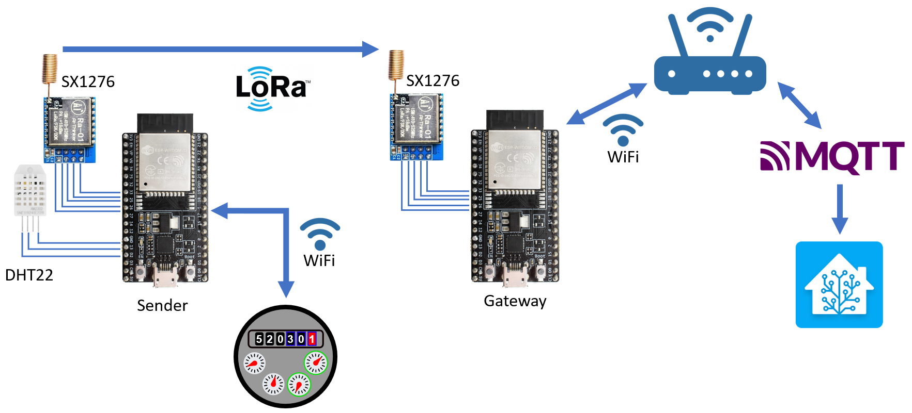

# LoRa-Watermeter
The Goal of this project is to integrate a watermeter of a house located in the forest.
To digitalize the watermeter we have used [github.com/jomjol/AI-on-the-edge-device](https://github.com/jomjol/AI-on-the-edge-device).
To transfer the data over the long distance, we´re using two esp32 with a point-to-point LoRa communication.

## Architecture

## Documentation
There is a specific README for each part of this project:
- [ESP32-LoRa-Gateway](./esp32-lora-gw/README.md)
- [ESP32-LoRa-Sender](./esp32-lora-sender/README.md)
- [Demo](./demo/README.md)
- [Watermeter](./watermeter/README.md)
